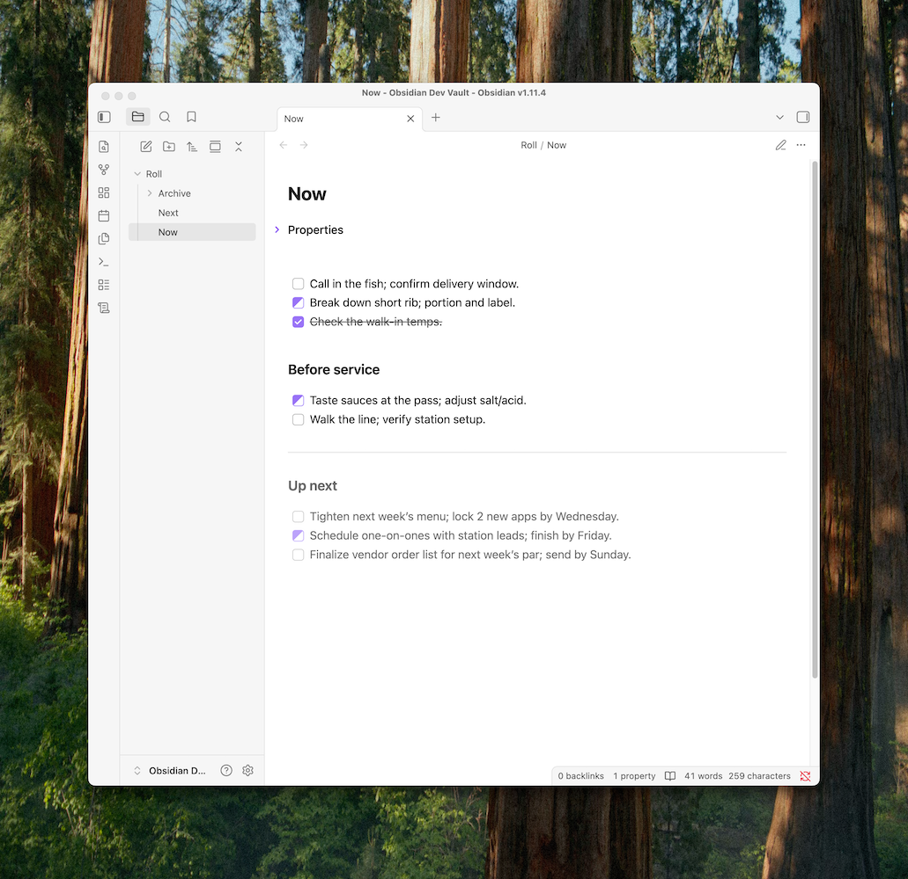

Roll is a one-page todo list for [Obsidian](https://obsidian.md/). One page. Three states. No due dates. No tags. Unfinished tasks roll forward.

## Design goals

Your _Now_ page is all that matters. When it gets cluttered, create a new one. Unfinished tasks roll forward, completed ones stay behind, and the old page is archived.

Tasks have 3 states: Todo → In Progress → Done. That's it. No deadlines. No clutter.

Optional _Next_ page to organize priorities. The _Future_ page is planned (coming soon) for big-picture things without timelines. _Next_ is for things that need doing, but not yet.

## Features

- Single _Now_ page: one place to look for tasks
- Tri-state checkboxes: `[ ]` → `[/]` → `[x]`
- Simple tasks organization with headings
- Automatic rollover of unfinished tasks
- Automatic archiving of old pages (searchable forever)

Inspired by bullet journals and the [Ugmonk Analog system](https://ugmonk.com/pages/analog).
